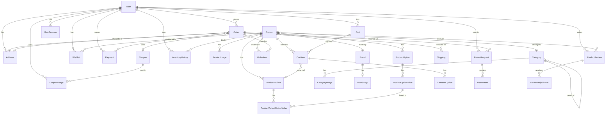

# Database Schema Documentation

## Overview

The ECommerce database uses SQL Server with Entity Framework Core 9. ASP.NET Core Identity is used for user management.

## Entity Relationship Diagram

## Tables

### Identity Tables
| Table | Description |
|-------|-------------|
| AspNetUsers | User accounts (extends IdentityUser) |
| AspNetRoles | User roles |
| AspNetUserRoles | User-role assignments |
| AspNetUserClaims | User claims |
| AspNetUserLogins | External login providers |
| AspNetUserTokens | User tokens |
| AspNetRoleClaims | Role claims |

### Product Domain
| Table | Description | Key Columns |
|-------|-------------|-------------|
| Products | Product catalog | Name, Price, SKU, CategoryId, BrandId |
| ProductImages | Product photos | ImageUrl, AltText, SortOrder, IsMain |
| ProductOptions | Configurable options | Name, DisplayType, Type, ProductId |
| ProductOptionValues | Option values | Value, Label, PriceValue, OptionId |
| ProductVariants | Product variants | SKU, VariantName, PriceAdjustment, StockQuantity |
| ProductVariantOptionValues | Variant-option links | ProductVariantId, ProductOptionValueId |

### Category & Brand Domain
| Table | Description | Key Columns |
|-------|-------------|-------------|
| Categories | Product categories | Name, ParentCategoryId, Level |
| CategoryImages | Category photos | ImageUrl, AltText, CategoryId |
| Brands | Product brands | Name, Website |
| BrandLogos | Brand logo images | ImageUrl, BrandId |

### Order Domain
| Table | Description | Key Columns |
|-------|-------------|-------------|
| Orders | Customer orders | OrderNumber, TotalAmount, Status, UserId |
| OrderItems | Order line items | Quantity, UnitPrice, ProductId, OrderId |

### Cart Domain
| Table | Description | Key Columns |
|-------|-------------|-------------|
| Carts | Shopping carts | UserId, Status |
| CartItems | Cart line items | Quantity, UnitPrice, ProductId, CartId |
| CartItemOptions | Selected options | CartItemId, ProductOptionId |

### User Domain
| Table | Description | Key Columns |
|-------|-------------|-------------|
| Addresses | User addresses | AddressLine1, City, Country, UserId |
| UserSessions | Active sessions | SessionToken, ExpiresAt, UserId |

### Review Domain
| Table | Description | Key Columns |
|-------|-------------|-------------|
| ProductReviews | Product reviews | Rating, Title, ProductId, UserId |
| ReviewHelpfulVotes | Review votes | IsHelpful, ReviewId, UserId |

### Commerce Domain
| Table | Description | Key Columns |
|-------|-------------|-------------|
| Wishlists | User wishlists | ProductId, UserId, Status |
| Coupons | Discount coupons | Code, DiscountType, DiscountValue |
| CouponUsages | Coupon usage tracking | CouponId, UserId, OrderId |
| Payments | Payment records | TransactionId, Amount, Status, OrderId |
| Shippings | Shipping records | TrackingNumber, Method, Cost, OrderId |
| ReturnRequests | Return requests | ReturnNumber, Reason, Status, OrderId |
| ReturnItems | Return line items | Quantity, Reason, ReturnRequestId |
| InventoryHistories | Stock changes | QuantityChange, ChangeType, ProductId |

## Key Relationships

- **User → Orders**: One-to-many (DeleteBehavior.NoAction)
- **Order → OrderItems**: One-to-many (DeleteBehavior.Cascade)
- **Order → ShippingAddress/BillingAddress**: Many-to-one (DeleteBehavior.NoAction)
- **Product → Category**: Many-to-one (DeleteBehavior.NoAction)
- **Product → Brand**: Many-to-one (DeleteBehavior.NoAction)
- **Brand → BrandLogo**: One-to-one (DeleteBehavior.Cascade)
- **Category → SubCategories**: Self-referencing (DeleteBehavior.NoAction)

## Enum Columns (stored as strings)
All enum properties are stored as `nvarchar` using `HasConversion<string>()`:
- Order.Status → OrderStatus
- Payment.Status → PaymentStatus
- Shipping.Status → ShippingStatus
- Product.Status → ProductStatus
- ProductVariant.StockStatus → StockStatus
- Coupon.DiscountType → DiscountType
- Address.Type → AddressType
- And more...

## Decimal Precision
All monetary columns use `decimal(18,2)`:
- Product.Price, Product.SalePrice
- OrderItem.UnitPrice, OrderItem.Discount
- Payment.Amount
- Shipping.Cost
- Coupon.DiscountValue, Coupon.MinimumOrderAmount
